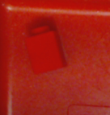
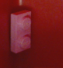
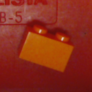
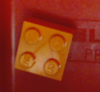
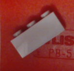

# Tray items classification

## Objective:

Identify all items in a tray.

## Data

Entire data set is available here: 
<a href="https://drive.google.com/file/d/1smbsz8AJ-VGhKbtr7NTvAVzTI3auI_C4/view?usp=sharing">all_data_HiRes.7z</a>,  
<a href="https://drive.google.com/file/d/1wZ-AHv4yx_lXGeaqKzbTNuap6mpESyEq/view?usp=sharing">all_data_LoRes.7z</a> 
*HiRes data set consists of images at 325x325 pixels resolution.* 
*LoRes data set conststs of images at 64x64 pixels resolution.*
  
Per class data set is available here.

| Class      | Notes            | Image         | Data (325x325px) | Data (64x64px) |
|:----------:| ---------------- | ------------- | ------------------- | ----------------- |
|  S1        |                  |  | <a href="./data_HiRes/S1_HiRes.7z">S1_HiRes.7z</a> | <a href="./data_LoRes/S1_LoRes.7z">S1_LoRes.7z</a> |
|  S2        |                  |  | <a href="./data_HiRes/S2_HiRes.7z">S2_HiRes.7z</a> | <a href="./data_LoRes/S2_LoRes.7z">S2_LoRes.7z</a> |
|  S3        |                  |  | <a href="./data_HiRes/S3_HiRes.7z">S3_HiRes.7z</a> | <a href="./data_LoRes/S3_LoRes.7z">S3_LoRes.7z</a> |
|  S4        |                  |  | <a href="./data_HiRes/S4_HiRes.7z">S4_HiRes.7z</a> | <a href="./data_LoRes/S4_LoRes.7z">S4_LoRes.7z</a> |
|  S5        |                  |  | <a href="./data_HiRes/S5_HiRes.7z">S5_HiRes.7z</a> | <a href="./data_LoRes/S5_LoRes.7z">S5_LoRes.7z</a> |
|  L1        |  Lego 4x1x1 GRN1 |  | <a href="./data_HiRes/L1_HiRes.7z">L1_HiRes.7z</a> | <a href="./data_LoRes/L1_LoRes.7z">L1_LoRes.7z</a> |
|  L2        |  Lego 4x1x2 YLW  |  | <a href="./data_HiRes/L2_HiRes.7z">L2_HiRes.7z</a> | <a href="./data_LoRes/L2_LoRes.7z">L2_LoRes.7z</a> |
|  L3        |  Lego 1x1x2 RED  |  | <a href="./data_HiRes/L3_HiRes.7z">L3_HiRes.7z</a> | <a href="./data_LoRes/L3_LoRes.7z">L3_LoRes.7z</a> |
|  L4        |  Lego 2x1x1 PNK  |  | <a href="./data_HiRes/L4_HiRes.7z">L4_HiRes.7z</a> | <a href="./data_LoRes/L4_LoRes.7z">L4_LoRes.7z</a> |
|  L5        |  Lego 2x1x2 ORG  |  | <a href="./data_HiRes/L5_HiRes.7z">L5_HiRes.7z</a> | <a href="./data_LoRes/L5_LoRes.7z">L5_LoRes.7z</a> |
|  L6        |  Lego 2x2x2 ORG  |  | <a href="./data_HiRes/L6_HiRes.7z">L6_HiRes.7z</a> | <a href="./data_LoRes/L6_LoRes.7z">L6_LoRes.7z</a> |
|  L7        |  Lego 3x1x2 GRY  |  | <a href="./data_HiRes/L7_HiRes.7z">L7_HiRes.7z</a> | <a href="./data_LoRes/L7_LoRes.7z">L7_LoRes.7z</a> |
| S1_S5      |                  |  | <a href="./data_HiRes/S1_S5_HiRes.7z">S1_S5_HiRes.7z</a> | <a href="./data_LoRes/S1_S5_LoRes.7z">S1_S5_LoRes.7z</a> |
| L2_S1_S5   |                 |  | <a href="./data_HiRes/L2_S1_S5_HiRes.7z">L2_S1_S5_HiRes.7z</a> | <a href="./data_LoRes/L2_S1_S5_LoRes.7z">L2_S1_S5_LoRes.7z</a> |
| L1_S1_S4_S5 | Unknown item added  |  | <a href="./data_HiRes/L1_S1_S4_S5_HiRes.7z">L1_S1_S4_S5_HiRes.7z</a> | <a href="./data_LoRes/L1_S1_S4_S5_LoRes.7z">L1_S1_S4_S5_LoRes.7z</a> |

Last updated: 2019-03-07