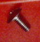
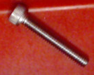
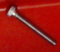
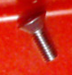
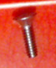
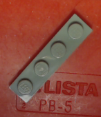
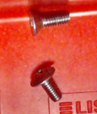
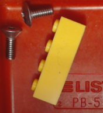
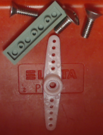

# Tray items classification

## Objective:

Identify all items in a tray.

## Data

Entire data set is available here: 
<a href="all_data_HiRes.7z.001">all_data_HiRes.7z.001</a>,  
<a href="all_data_HiRes.7z.002">all_data_HiRes.7z.002</a>,  
<a href="all_data_HiRes.7z.003">all_data_HiRes.7z.003</a>,  
<a href="all_data_HiRes.7z.004">all_data_HiRes.7z.004</a>,  
<a href="all_data_HiRes.7z.005">all_data_HiRes.7z.005</a>,  
<a href="all_data_LoRes.7z">all_data_LoRes.7z</a> 
*HiRes data set consists of images at 325x325 pixels resolution.* 
*LoRes data set conststs of images at 64x64 pixels resolution.*
  
Per class data set is available here.

| Class      | Notes           | Image         | Data (325x325px) | Data (64x64px) |
|:----------:| --------------- | ------------- | ------------------- | ----------------- |
|  S1        |                 |  | <a href="S1_HiRes.7z">S1_HiRes.7z</a> | <a href="S1_LoRes.7z">S1_LoRes.7z</a> |
|  S2        |                 |  | <a href="S2_HiRes.7z">S2_HiRes.7z</a> | <a href="S2_LoRes.7z">S2_LoRes.7z</a> |
|  S3        |                 |  | <a href="S3_HiRes.7z">S3_HiRes.7z</a> | <a href="S3_LoRes.7z">S3_LoRes.7z</a> |
|  S4        |                 |  | <a href="S4_HiRes.7z">S4_HiRes.7z</a> | <a href="S4_LoRes.7z">S4_LoRes.7z</a> |
|  S5        |                 |  | <a href="S5_HiRes.7z">S5_HiRes.7z</a> | <a href="S5_LoRes.7z">S5_LoRes.7z</a> |
|  L1        |  Lego 4x1x1     |  | <a href="L1_HiRes.7z">L1_HiRes.7z</a> | <a href="L1_LoRes.7z">L1_LoRes.7z</a> |
|  L2        |  Lego 4x1x2     |  | <a href="L2_HiRes.7z">L2_HiRes.7z</a> | <a href="L2_LoRes.7z">L2_LoRes.7z</a> |
| S1_S5      |                 |  | <a href="S1_S5_HiRes.7z">S1_S5_HiRes.7z</a> | <a href="S1_S5_LoRes.7z">S1_S5_LoRes.7z</a> |
| L2_S1_S5   |                 |  | <a href="L2_S1_S5_HiRes.7z">L2_S1_S5_HiRes.7z</a> | <a href="L2_S1_S5_LoRes.7z">L2_S1_S5_LoRes.7z</a> |
| L1_S1_S4_S5 | Unknown item added  |  | <a href="L1_S1_S4_S5_HiRes.7z">L1_S1_S4_S5_HiRes.7z</a> | <a href="L1_S1_S4_S5_LoRes.7z">L1_S1_S4_S5_LoRes.7z</a> |

Last updated: 2019-01-25