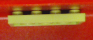
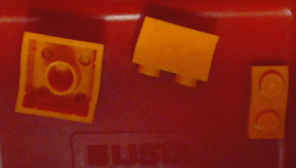
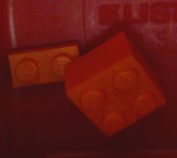
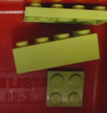
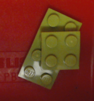

# Tray items classification

## Objective:

Identify all items in a tray.

## Data

Entire data set is available here: 
<a href="https://drive.google.com/file/d/1smbsz8AJ-VGhKbtr7NTvAVzTI3auI_C4/view?usp=sharing">all_data_HiRes.7z</a>,  
<a href="https://drive.google.com/file/d/1wZ-AHv4yx_lXGeaqKzbTNuap6mpESyEq/view?usp=sharing">all_data_LoRes.7z</a> 
*HiRes data set consists of images at 325x325 pixels resolution.* 
*LoRes data set conststs of images at 64x64 pixels resolution.*
  
###Single class data set is available here.

| Class      | Notes              | Image            | Data (325x325px) | Data (64x64px) |
|:---------- | ------------------ | ---------------- | ------------------- | ----------------- |
|  S1        |                    |   | <a href="./data_HiRes/single/S1_HiRes.7z">S1_HiRes.7z</a>   | <a href="./data_LoRes/single/S1_LoRes.7z">S1_LoRes.7z</a> |
|  S2        |                    |   | <a href="./data_HiRes/single/S2_HiRes.7z">S2_HiRes.7z</a>   | <a href="./data_LoRes/single/S2_LoRes.7z">S2_LoRes.7z</a> |
|  S3        |                    |   | <a href="./data_HiRes/single/S3_HiRes.7z">S3_HiRes.7z</a>   | <a href="./data_LoRes/single/S3_LoRes.7z">S3_LoRes.7z</a> |
|  S4        |                    |   | <a href="./data_HiRes/single/S4_HiRes.7z">S4_HiRes.7z</a>   | <a href="./data_LoRes/single/S4_LoRes.7z">S4_LoRes.7z</a> |
|  S5        |                    |   | <a href="./data_HiRes/single/S5_HiRes.7z">S5_HiRes.7z</a>   | <a href="./data_LoRes/single/S5_LoRes.7z">S5_LoRes.7z</a> |
|  L1        |  Lego 4x1x1 GRN1   |  | <a href="./data_HiRes/single/L01_HiRes.7z">L01_HiRes.7z</a> | <a href="./data_LoRes/single/L01_LoRes.7z">L01_LoRes.7z</a> |
|  L2        |  Lego 4x1x2 YLW    |  | <a href="./data_HiRes/single/L02_HiRes.7z">L02_HiRes.7z</a> | <a href="./data_LoRes/single/L02_LoRes.7z">L02_LoRes.7z</a> |
|  L3        |  Lego 1x1x2 RED    |  | <a href="./data_HiRes/single/L03_HiRes.7z">L03_HiRes.7z</a> | <a href="./data_LoRes/single/L03_LoRes.7z">L03_LoRes.7z</a> |
|  L4        |  Lego 2x1x1 PNK    |  | <a href="./data_HiRes/single/L04_HiRes.7z">L04_HiRes.7z</a> | <a href="./data_LoRes/single/L04_LoRes.7z">L04_LoRes.7z</a> |
|  L5        |  Lego 2x1x2 ORG    |  | <a href="./data_HiRes/single/L05_HiRes.7z">L05_HiRes.7z</a> | <a href="./data_LoRes/single/L05_LoRes.7z">L05_LoRes.7z</a> |
|  L6        |  Lego 2x2x2 ORG    |  | <a href="./data_HiRes/single/L06_HiRes.7z">L06_HiRes.7z</a> | <a href="./data_LoRes/single/L06_LoRes.7z">L06_LoRes.7z</a> |
|  L7        |  Lego 3x1x2 GRY    |  | <a href="./data_HiRes/single/L07_HiRes.7z">L07_HiRes.7z</a> | <a href="./data_LoRes/single/L07_LoRes.7z">L07_LoRes.7z</a> |
|  L8        |  Lego 4x2x2 LIM    |  | <a href="./data_HiRes/single/L08_HiRes.7z">L08_HiRes.7z</a> | <a href="./data_LoRes/single/L08_LoRes.7z">L08_LoRes.7z</a> |
|  L9        |  Lego 4x2x1 LIM    |  | <a href="./data_HiRes/single/L09_HiRes.7z">L09_HiRes.7z</a> | <a href="./data_LoRes/single/L09_LoRes.7z">L09_LoRes.7z</a> |
|  L10       |  Lego 2x1x1 ORN    |  | <a href="./data_HiRes/single/L10_HiRes.7z">L10_HiRes.7z</a> | <a href="./data_LoRes/single/L10_LoRes.7z">L10_LoRes.7z</a> |
|  L11       |  Lego 2x2x1 LIM    |  | <a href="./data_HiRes/single/L11_HiRes.7z">L11_HiRes.7z</a> | <a href="./data_LoRes/single/L11_LoRes.7z">L11_LoRes.7z</a> |
|  L12       |  Lego 4x1x2 PNK    |  | <a href="./data_HiRes/single/L12_HiRes.7z">L12_HiRes.7z</a> | <a href="./data_LoRes/single/L12_LoRes.7z">L12_LoRes.7z</a> |
|  L13       |  Lego 2x1x1 GRY    |  | <a href="./data_HiRes/single/L13_HiRes.7z">L13_HiRes.7z</a> | <a href="./data_LoRes/single/L13_LoRes.7z">L13_LoRes.7z</a> |
|  L14       |  Lego 2x1x1 H1 GRY |  | <a href="./data_HiRes/single/L14_HiRes.7z">L14_HiRes.7z</a> | <a href="./data_LoRes/single/L14_LoRes.7z">L14_LoRes.7z</a> |
|  L15       |  Lego 2x1x1 H2 GRY |  | <a href="./data_HiRes/single/L15_HiRes.7z">L15_HiRes.7z</a> | <a href="./data_LoRes/single/L15_LoRes.7z">L15_LoRes.7z</a> |
|  L16       |  Lego 3x2x1 RED    |  | <a href="./data_HiRes/single/L16_HiRes.7z">L16_HiRes.7z</a> | <a href="./data_LoRes/single/L16_LoRes.7z">L16_LoRes.7z</a> |
|  L17       |  Lego 4x2x1 RED    |  | <a href="./data_HiRes/single/L17_HiRes.7z">L17_HiRes.7z</a> | <a href="./data_LoRes/single/L17_LoRes.7z">L17_LoRes.7z</a> |
|  L18       |  Lego 1x1x1 RED    |  | <a href="./data_HiRes/single/L18_HiRes.7z">L18_HiRes.7z</a> | <a href="./data_LoRes/single/L18_LoRes.7z">L18_LoRes.7z</a> |

 

------------------------

 
### Multi class data is available here:
 

| Class       | Notes              | Image                     | Data (325x325px)         | Data (64x64px) |
|:----------- | ------------------ | ------------------------- | --------------------------- | ----------------- |
| S1_S5       |                    |         | <a href="./data_HiRes/multi/S1_S5_HiRes.7z">S1_S5_HiRes.7z</a>         | <a href="./data_LoRes/multi/S1_S5_LoRes.7z">S1_S5_LoRes.7z</a>        |
| L2_S1_S5    |                    |     | <a href="./data_HiRes/multi/L02_S1_S5_HiRes.7z">L02_S1_S5_HiRes.7z</a> | <a href="./data_LoRes/multi/L2_S1_S5_LoRes.7z">L02_S1_S5_LoRes.7z</a> |
| L1_S1_S4_S5 | Unknown item added |  | <a href="./data_HiRes/multi/L01_S1_S4_S5_HiRes.7z">L01_S1_S4_S5_HiRes.7z</a> | <a href="./data_LoRes/multi/L1_S1_S4_S5_LoRes.7z">L01_S1_S4_S5_LoRes.7z</a> |
| L05_L06_L10 |                    |   | <a href="./data_HiRes/multi/L05_L06_L10_HiRes.7z">L05_L06_L10_HiRes.7z</a>   | <a href="./data_LoRes/multi/L05_L06_L10_LoRes.7z">L05_L06_L10_LoRes.7z</a>  |
| L06_L10     |                    |       | <a href="./data_HiRes/multi/L06_L10_HiRes.7z">L06_L10_HiRes.7z</a>     | <a href="./data_LoRes/multi/L06_L10_LoRes.7z">L06_L10_LoRes.7z</a>  |
| L08_L09_L11 |                    |   | <a href="./data_HiRes/multi/L08_L09_L11_HiRes.7z">L08_L09_L11_HiRes.7z</a>   | <a href="./data_LoRes/multi/L08_L09_L11_LoRes.7z">L08_L09_L11_LoRes.7z</a>  |
| L09_L11     |                    |       | <a href="./data_HiRes/multi/L09_L11_HiRes.7z">L09_L11_HiRes.7z</a>     | <a href="./data_LoRes/multi/L09_L11_LoRes.7z">L09_L11_LoRes.7z</a>  |

Last updated: 2019-03-15